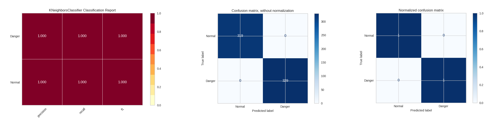
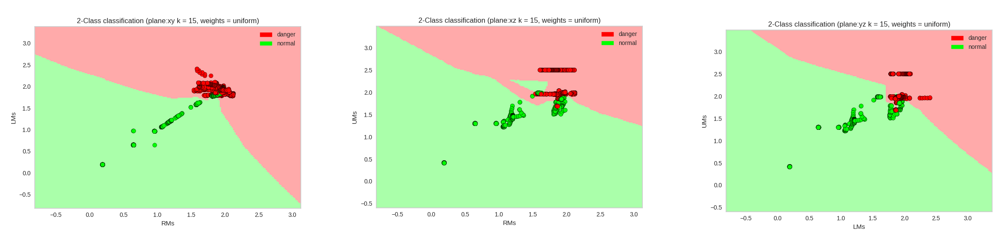
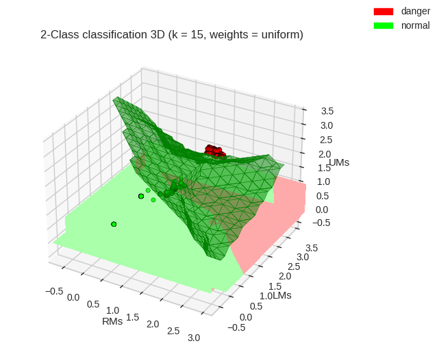

[![Contributors][contributors-shield]][contributors-url]
[![Forks][forks-shield]][forks-url]
[![Stargazers][stars-shield]][stars-url]
[![Issues][issues-shield]][issues-url]
[![MIT License][license-shield]][license-url]

<!-- PROJECT LOGO -->
<br />
<p align="center">
  <a href="https://github.com/CaptainMich/ML-Classifier">
    
  </a>

  <h1 style="font-size: 45px" align="center"> <b>ML-Classifier</b> </h1>

  <p align="center">
    This project aims to identify <b>"normal"</b> or <b>"danger"</b> objects in conveyor belt of an airport  <br/>
    <a href="https://github.com/CaptainMich/ML-Classifier"><strong>Explore the docs »</strong></a>
    <br />
    <br />
    <a href="https://github.com/CaptainMich/ML-Classifier">View Demo</a>
    ·
    <a href="https://github.com/CaptainMich/ML-Classifier/issues">Report Bug</a>
    ·
    <a href="https://github.com/CaptainMich/ML-Classifier/issues">Request Feature</a>
  </p>
</p>


<!-- TABLE OF CONTENTS -->
## Table of Contents 

<details open="open">
  <summary>Table of Contents</summary>
  <ol style="margin-left: 20em;">
    <li>
      <a href="#getting-started">Getting Started</a>
      <ul>
        <li><a href="#prerequisites">Prerequisites</a></li>
        <li><a href="#how-it-works">How it works?</a></li>
      </ul>
    </li>
    <li>
      <a href="#getting-started">Options</a>
      <ul>
        <li><a href="#dataset">Dataset</a></li>
        <li><a href="#configuration">Configuration</a></li>
      </ul>
    </li>
    <li><a href="#roadmap">Roadmap</a></li>
    <li><a href="#contributing">Contributing</a></li>
    <li><a href="#license">License</a></li>
  </ol>
</details>

## Getting Started

### Prerequisites

You need to install the following packets using pip

* pip
    ```sh
    pip install pandas
    pip install fpdf
    pip install sklearn
    pip install matplotlib
    pip install yellowbrick
    ```

### How it works?

Run `main.py` and see a PDF report in the *./output/info* (one for each selected classifier is generated). <br> 
All the plots are stored in the *./output/plot* : <br> <br>

* Precision/Recall/F1 Report and Confusion Matrix (with and without normalization) <br> <br>
  <a href="https://github.com/CaptainMich/ML-Classifier">
    
  </a> <br>

* Decision Boundary 2D for all plane <br> <br>
  <a href="https://github.com/CaptainMich/ML-Classifier">
    
  </a> <br>

* Decision Boundary 3D <br> <br>
  <a align="center" href="https://github.com/CaptainMich/ML-Classifier">
    
  </a>
## Options

### Dataset

Dataset is made by the measures of three different sensors, ***'RMs'*** ***'LMs'*** ***'UMs'*** placed respectively in the right, in the left and up. <br> 
Format is the following 

| RMs | LMs | UMs | Class |
| --- | --- | --- |  --- |
|1.98242 | 2.017493 | 2.015046 | Object

### Configuration

Configuration file entries are:

- ***csv_path*** : the path of csv dataset folder; can be also one single file
- ***classes*** : list of the two classes identifier since the classifier is binary
- ***classifiers*** : list containing all the classifiers we want to use. All possibilities are: <br>
                 *["Naive-Bayes", "LinearSVC", "KNN", "DecisionTree", "LogisticRegression", "LDA", "SVM"]*
- ***csv_cols*** : list of features; must contains only 2 values
- ***csv_labels*** : list of labels
- ***normal*** : list of normal objects 
- ***danger*** : list of danger objects
- ***plot_path*** : the path of the plot output
- ***info_path*** : the path of the pdf output

<!-- ROADMAP -->
## Roadmap

See the [open issues](https://github.com/othneildrew/Best-README-Template/issues) for a list of proposed features (and known issues).

<!-- CONTRIBUTING -->
## Contributing

Contributions are what make the open source community such an amazing place to be learn, inspire, and create. Any contributions you make are **greatly appreciated**.

1. Fork the Project
2. Create your Feature Branch (`git checkout -b feature/AmazingFeature`)
3. Commit your Changes (`git commit -m 'Add some AmazingFeature'`)
4. Push to the Branch (`git push origin feature/AmazingFeature`)
5. Open a Pull Request

<!-- LICENSE -->
## License

This project is licensed under the MIT License - see the [LICENSE](LICENSE) file for details


<!-- MARKDOWN LINKS & IMAGES -->
<!-- https://github.com/CaptainMich/ML-Classifier/ --> 
[contributors-shield]: https://img.shields.io/github/contributors/CaptainMich/ML-Classifier.svg?style=for-the-badge
[contributors-url]: https://github.com/CaptainMich/ML-Classifier/graphs/contributors
[forks-shield]: https://img.shields.io/github/forks/CaptainMich/ML-Classifier.svg?style=for-the-badge
[forks-url]: https://github.com/CaptainMich/ML-Classifier/network/members
[stars-shield]: https://img.shields.io/github/stars/CaptainMich/ML-Classifier.svg?style=for-the-badge
[stars-url]: https://github.com/CaptainMich/ML-Classifier/stargazers
[issues-shield]: https://img.shields.io/github/issues/CaptainMich/ML-Classifier.svg?style=for-the-badge
[issues-url]: https://github.com/CaptainMich/ML-Classifier/issues
[license-shield]: https://img.shields.io/github/license/CaptainMich/ML-Classifier.svg?style=for-the-badge
[license-url]: https://github.com/CaptainMich/ML-Classifier/blob/master/LICENSE
